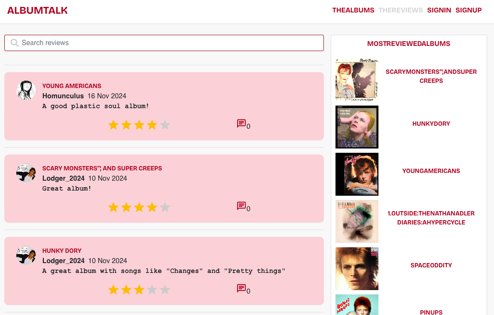

# AlbumTalk (David Bowie edition)


AlbumTalk is a dynamic web application designed for music enthusiasts to write, share, and discuss reviews of music albums. It serves as a community platform where users can discover new music, express their opinions on albums, and engage in meaningful discussions with fellow music lovers. The application aims to foster a vibrant community centered around music appreciation and critique.

AlbumTalk (David Bowie edition) is a pilot to test the concept on a smaller scale This special edition of AlbumTalk focuses exclusively on David Bowie's extensive discography, providing a rich and immersive experience for both longtime fans and newcomers. Users can review, rate, and discuss albums in David Bowie's extensive catalog, as well as follow other users.

[albumTalk](https://album-talk-68a3b5c7423a.herokuapp.com/)

## Table of Contents

- [AlbumTalk (David Bowie edition)](#albumtalk-david-bowie-edition)
  - [Table of Contents](#table-of-contents)
  - [Backend API](#backend-api)
  - [UX](#ux)
    - [User Goals](#user-goals)
      - [Engage with and discover Albums](#engage-with-and-discover-albums)
        - [Discover reviews](#discover-reviews)
        - [Participate in discussions](#participate-in-discussions)
        - [Build and manage a profile](#build-and-manage-a-profile)
        - [Navigate and search easily](#navigate-and-search-easily)
        - [Control personal contributions](#control-personal-contributions)
        - [Secure access](#secure-access)
    - [Agile and planning](#agile-and-planning)
    - [Wireframes:](#wireframes)
    - [Epics and User Stories:](#epics-and-user-stories)
    - [Design Choices](#design-choices)
      - [Colors](#colors)
      - [Typography](#typography)
        - [Font](#font)
        - [Text Styling](#text-styling)
      - [Imagery and icons](#imagery-and-icons)
  - [Features](#features)
    - [Navigation](#navigation)
    - [Home page / Albums page](#home-page--albums-page)
    - [Sign in page](#sign-in-page)
    - [Sign up page](#sign-up-page)
    - [Profile page](#profile-page)
    - [Reviews page (THEREVIEWS)](#reviews-page-thereviews)
    - [Add comment](#add-comment)
    - [Comment page](#comment-page)
  - [Future Features](#future-features)
  - [Reusability](#reusability)
    - [Components](#components)
      - [Asset component](#asset-component)
      - [Avatar component](#avatar-component)
      - [Moredropdown component](#moredropdown-component)
      - [Navbar component](#navbar-component)
      - [React simple star rating](#react-simple-star-rating)
      - [React Infinite Scroll Component](#react-infinite-scroll-component)
    - [Frameworks and libraries](#frameworks-and-libraries)
  - [Testing](#testing)
    - [Manual testing and Validation](#manual-testing-and-validation)
  - [Development and Deployment](#development-and-deployment)
    - [Forking and clone the GitHub Repository](#forking-and-clone-the-github-repository)
      - [Forking a Repository](#forking-a-repository)
      - [Cloning Your Forked Repository](#cloning-your-forked-repository)
      - [Installing and starting the application locally](#installing-and-starting-the-application-locally)
    - [Heroku](#heroku)
  - [Credits](#credits)
    - [Content](#content)
    - [Media](#media)
  - [Acknowledgements:](#acknowledgements)

## Backend API

The backend api that is used by AlbumTalk is documented [here](https://github.com/andersganander/AlbumTalk_API)

## UX

### User Goals

#### Engage with and discover Albums

- View and explore albums through lists, including most-rated ones.
- Interact with albums by liking favorites and leaving reviews.
- Use visual ratings to provide feedback.

##### Discover reviews

- Access and read specific reviews for albums.
- Browse lists of reviews.
- Easily find a specific user's reviews.

##### Participate in discussions

- Write, edit, and delete comments on reviews.

##### Build and manage a profile

- Create and update a user profile.
- Access user statistics.
- Follow and unfollow users, with plans to view followed users' reviews.

##### Navigate and search easily

- Navigate seamlessly between pages with ease.
- Use infinite scroll functionality for continuous browsing.
- Search for reviews and albums efficiently.

##### Control personal contributions

- Edit and delete personal reviews or comments.

##### Secure access

- Create accounts and manage login securely.
- Update credentials as needed.

### Agile and planning

The API and Frontend of this project was planned using Agile methodology and MoSCoW prioritization on github projects.

The user stories project can be found [here](https://github.com/users/andersganander/projects/6/views/2)

### Wireframes:

<details>
<summary>Mobile</summary>


</details>

<details>
<summary>Desktop</summary>


</details>

### Epics and User Stories:

Project user stories can be found [here](https://github.com/andersganander/albumtalk/issues?q=is%3Aissue+label%3A%22User+Story%22)


| Epic                   | User Story                    | Comment    |
| :----------------------- | :------------------------------ | :----------- |
| Authentication         | Create Account                | [#5][i5]   |
| Authentication         | Update User credentials       | [#27][i27] |
| Authentication         | Log in                        | [#6][i6]   |
| Navigation             | Navigate easily between pages | [#21][i21] |
| Navigation             | Infinite scroll functionality | [#20][i20] |
| Albums                 | Album List                    | [#30][i30] |
| Albums                 | List of most rated albums     | [#25][i25] |
| Albums                 | Like favorite albums          | [#32][i32] |
| Write review           | Write a review                | [#7][i7]   |
| Write review           | Visual rating                 | [#50][i50] |
| View reviews           | View album specific reviews   | [#31][i31] |
| View reviews           | List reviews                  | [#17][i17] |
| View reviews           | View a review                 | [#9][i9]   |
| Edit and delete review | Edit a review                 | [#10][i10] |
| Edit and delete review | Delete a review               | [#11][i11] |
| Comments               | Edit a comment                | [#15][i15] |
| Comments               | Write a comment               | [#13][i13] |
| Comments               | Delete a comment              | [#14][i14] |
| Follow/unfollow        | Follow and unfollow users     | [#24][i24] |
| Follow/unfollow        | View followed users reviews   | [#19][i19] |
| Profile page           | Edit profile                  | [#26][i26] |
| Profile page           | User statistics               | [#23][i23] |
| Profile page           | View profile page             | [#22][i22] |
| Search                 | Search for reviews and albums | [#12][i12] |

### Design Choices

The design takes heavy inspiration from the minimalist, avant-garde aesthetic of the David Bowie album Station to Station's album cover. This is reflected in the typography, color palette, layout, and overall mood of the website. The result is a modern, immersive site that pays homage to David Bowie's bold and innovative artistic identity.

#### Colors

- White for backgrounds to evoke the album's clean and modern feel.
- Light red for backgrounds for reviews
- Light blue for backgrounds for comments
- Black for bold contrasts in typography.
- Deep Red accents inspired by the subtle use of red tones in the album's design.

  The choice of the different backgropund colors for different sections is aimed at creating clear visual separation and enhancing the user’s ability to navigate and understand the content.

#### Typography

##### Font
The primary typeface mimics the stark, geometric sans-serif typography used on Station to Station. The font used is Bricolage Grotesque. For longer texts like description etc, Courier New is used.

##### Text Styling 
All text elements, except for longer texts like descriptitions etc, feature uppercase letters with a condensed spacing, creating a compact and impactful visual.

Inspired by the album cover on Station to Station, words are presented without spaces, creating a unified, continuous text flow (e.g., StationtoStation, DavidBowieAlbums). This is used in the navbar, links, headings etc.

[Station to Station - Front cover](https://www.discogs.com/master/22420-David-Bowie-Station-To-Station/image/SW1hZ2U6OTU4Nzk0OA==) <br/>
[Station to Station - Back cover](https://www.discogs.com/master/22420-David-Bowie-Station-To-Station/image/SW1hZ2U6OTU4Nzk1Mg==)

#### Imagery and icons

Since the albums are central, album covers are used on all pages. In addition to album covers and a login page image, no other images are used.

Icons are frequently used on the website. They are used partly on the album page to symbolize functions such as "View reviews," "Add to favorites albums," and "Show description." Some icons have a number next to them indicating the number of reviews or comments. To make it clearer for the user what the icons mean, a tooltip is displayed when the user hovers over the icon with the mouse. Some icons and buttons are only shown when the user is logged in.

## Features

### Navigation

- On medium and larger screens, there is a navbar at the top
- The menu contains options for viewing albums (THEALBUMS) and reviews (THEREVIEWS)


- Depending on if the user has logged in or not there are also options for Sign In, Sign Out and Sign Up
- When the user is logged in, the users Avatar is displayed in the upper right corner


- On smaller screens there's a hamburger menu and a slide out menu to the left with the same options and the same logic for login and logout

### Home page / Albums page

- The home page is the same as the album page
- The page contain a scrollable list of all David Bowie albums in chronological order
- To the right there's a list of most follwed users
- Without being logged in the user can view reviews and album descriptions
- Below the description are links to Wikipedia and Discogs for more information about the album.

 <br>

- When the user is logged they can:
  - Review and rate albums
  - Mark an an album as a favorite
  - Remove an album from their favorites


- When the Add review icon is clicked, a text field is shown.


### Sign in page


### Sign up page


### Profile page

- At the top, under the profile's name, it shows how many reviews the user has written, how many followers the profile has, and how many other profiles it follows. Then the profiles' introduction.
- Below the introduction, the user's reviews are displayed.
- On the left side of the page, there is a list of the profile's favorite albums.


- When a user is logged in he/she has the ability to access a dropdown menu with the options:
  - edit profile
  - change username
  - change password


### Reviews page (THEREVIEWS)

- All reviews are displayed in a scrollable list
- A search field at the top makes it easy to search for an albums reviews
- For logged in users there will be a dropdown menu with options for deleting and edit their own reviews



### Add comment

- When the Add comment icon is clicked, a textfield is shown.


### Comment page

- When the user is logged in, a dropdown menu is shown for the users' comments where the user can choose to edit or delete the comment.
  

## Future Features

AlbumTalk David Bowie edition is a proof of concept for how a forum for discussions about artists and their music could look. The idea is for this concept to develop into a platform for discussions about all artists and their albums. The major change in how this proof of concept appears will be the homepage. Instead of going directly to a list of an artist's albums, it could consist of, for example:

- A search function where you can search for artists or albums and then go directly to that page.
- List of latest reviews
- List of highest-rated albums
- List of most reviewed albums/artists

Proposals for other potential improvements are:

- More information about users, such as favorite artist, etc. 
- The possibility to specify a favorite song when reviewing an album
- The possibility to indicate whether you have a certain album on vinyl/CD 
- The possibility to send direct messages to other users
- Show a list of logged in users

## Reusability

### Components

#### Asset component

Displays a media asset, such as images, spinner animations, and messages. Used for displaying a spinner animation when data is loading.

#### Avatar component

This component displays an avatar image along with optional text content.

#### Moredropdown component

Provides a dropdown menu for actions like editing and deleting items.

#### Navbar component

This is a React component called NavBar that implements a navigation bar for the application. It uses React Bootstrap components and custom styling.

#### React simple star rating

A react component for adding star rating. Used in review for visual rating.

#### React Infinite Scroll Component

Implements infinite scrolling, loading content as the user scrolls down, enhancing user experience.

### Frameworks and libraries

- React 18.3.1: JavaScript library for building user interfaces.
- React Bootstrap 1.6.3:  React component library that provides Bootstrap components built with React.
- React Router DOM 5.3.0: Routing library for React applications.
- Axios 1.7.2: JavaScript library used for making HTTP requests from both the browser and Node.js environment.
- react-infinite-scroll-component 6.1.0: Described in the Components section.
- react-simple-star-rating 5.1.7: Described in the Components section.

## Testing

### Manual testing and Validation

Testng, validation and bugs is described in the testing documentation.
[Manual testing](./TESTING.md)

## Development and Deployment

### Forking and clone the GitHub Repository

#### Forking a Repository
- Go to the repository you want to fork on GitHub.com.
- Click the "Fork" button in the top-right corner of the repository page.
- Choose where you want to fork the repository (usually your personal account).
- Wait for the fork to be created on GitHub.

#### Cloning Your Forked Repository
- On your local machine, open a terminal or command prompt.
- Navigate to the directory where you want to clone the repository.
- Run the following command, replacing USERNAME with your GitHub username:

```
git clone https://github.com/USERNAME/repository-name.git
```

- Press Enter to clone the repository.

#### Installing and starting the application locally

Install Dependencies:

`npm install`

Run Application:

`npm start` 

### Heroku

The api is being hosted and deployed on Heroku:

- Log in to the Heroku Dahboard
- Create a New App
  - Click New > Create New App
  - Choose a name for your app (e.g., your-app-name) and select a region.
- Set up GitHub integration
  - In your app's dashboard, go to the Deploy tab
  - Under Deployment method, select GitHub
  - Authenticate and search for your repository.
  - Click Connect to link the repository.
- Prepare the application for deploy
  - In package.json file, in the “scripts” section, add the following prebuild command: <br>
  `"heroku-prebuild": "npm install -g serve",`
  - Add a Procfile at the root of the project with the following web command: <br>
  `web: serve -s build`
- Deploy the application
  - Automatic deployments
    - In the Deploy tab, enable Automatic Deploys if you want Heroku to deploy every time you push changes to the main branch.
  - Manual deployment
    - If you prefer, deploy manually by clicking Deploy Branch under Manual Deploy.
- Test the deployment
  - Open the application
    - Click the button that is shown after the deployment or click the button "Open app" in the upper right corner.
  - Monitor logs
    - In the More dropdown, select View Logs to troubleshoot any issues.

- The live app can be found [here](https://album-talk-68a3b5c7423a.herokuapp.com/).

## Credits

### Content

This project has greatly benefited from the educational resources and example projects provided by the Code Institute. The following projects were particularly influential in shaping the development of this application:

- **Django REST Framework Example Project**: This practical example from the Code Institute served as a crucial reference for constructing Web APIs using the Django REST framework. It provided a solid foundation and template for implementing best practices in API development with Django and Python.
- **Moments Project**: The Moments project, another invaluable resource from the Code Institute, demonstrated the creation of a full-stack application with a strong emphasis on user experience. This project showcased how to utilize the API developed in the earlier example project, highlighting several key aspects of its design and functionality that were adapted and integrated into this project.
- Some of the reviews and comments were written by ChatGPT.

### Media

- [AudioDB](https://www.theaudiodb.com/) - Images on the signin/signup page and album cover images.
- [Google Fonts](https://www.theaudiodb.com/) - The Bricolage Grotesque fontnand some icons.
- [Font Awesome](https://fontawesome.com/) - Icons such as star, searchicon and others.

## Acknowledgements:

- My mentor, Antonio.
- The Swedish community on Slack, always ready and willing to help and support.

 [i5]: https://github.com/andersganander/albumtalk/issues/5

 [i27]: https://github.com/andersganander/albumtalk/issues/27

 [i6]: https://github.com/andersganander/albumtalk/issues/6

 [i21]: https://github.com/andersganander/albumtalk/issues/21

 [i20]: https://github.com/andersganander/albumtalk/issues/20

 [i30]: https://github.com/andersganander/albumtalk/issues/30

 [i25]: https://github.com/andersganander/albumtalk/issues/25

 [i32]: https://github.com/andersganander/albumtalk/issues/32

 [i7]: https://github.com/andersganander/albumtalk/issues/7

 [i50]: https://github.com/andersganander/albumtalk/issues/50

 [i17]: https://github.com/andersganander/albumtalk/issues/17

 [i9]: https://github.com/andersganander/albumtalk/issues/9

 [i10]: https://github.com/andersganander/albumtalk/issues/10

 [i11]: https://github.com/andersganander/albumtalk/issues/11

 [i15]: https://github.com/andersganander/albumtalk/issues/15

 [i13]: https://github.com/andersganander/albumtalk/issues/13

 [i14]: https://github.com/andersganander/albumtalk/issues/14

 [i24]: https://github.com/andersganander/albumtalk/issues/24

 [i19]: https://github.com/andersganander/albumtalk/issues/19

 [i26]: https://github.com/andersganander/albumtalk/issues/26

 [i23]: https://github.com/andersganander/albumtalk/issues/23

 [i22]: https://github.com/andersganander/albumtalk/issues/22

 [i12]: https://github.com/andersganander/albumtalk/issues/12

 [i31]: https://github.com/andersganander/albumtalk/issues/31
