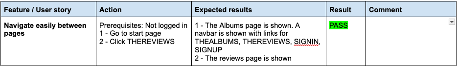
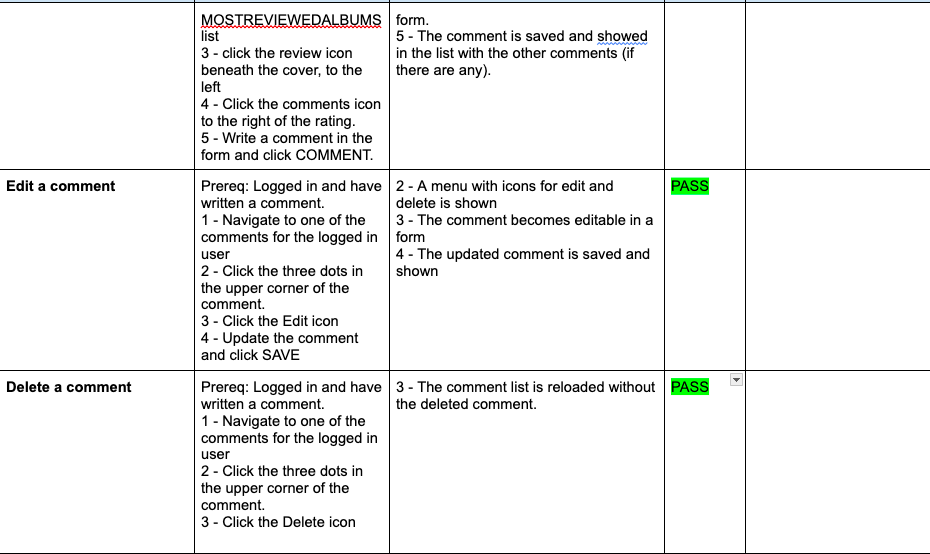

## Table of contents

<!-- TOC -->

- [Table of contents](#table-of-contents)
- [Manual Testing](#manual-testing)
  - [Epic: Account](#epic-account)
  - [Epic: Navigation](#epic-navigation)
  - [Epic: Albums](#epic-albums)
  - [Epic: Write review](#epic-write-review)
  - [Epic: Edit and delete review](#epic-edit-and-delete-review)
  - [Epic: View reviews](#epic-view-reviews)
  - [Epic: Comments](#epic-comments)
  - [Epic: Profile page](#epic-profile-page)
  - [Epic: Follow/unfollow](#epic-followunfollow)
  - [Epic: Search](#epic-search)
- [Validator Testing](#validator-testing)
  - [ESLint](#eslint)
  - [CSS](#css)
  - [Python](#python)
  - [Lighthouse](#lighthouse)
- [Browser Testing](#browser-testing)
- [Device Testing](#device-testing)
- [Bugs](#bugs)
  - [Fixed Bugs](#fixed-bugs)
  - [Unfixed bugs](#unfixed-bugs)

<!-- /TOC -->

## Manual Testing

All user stories have been manually tested upon implementation, and this has been documented in each user story by the fulfilled acceptance criteria for each user story. In connection with the deployment to Heroku, which occurred in each sprint, testing was also conducted there. In addition to these continuous tests, manual tests were conducted at the end of sprint 17. The results of these tests are presented below.

### Epic: Account

 

 

 

### Epic: Navigation

 

 

### Epic: Albums

 

 

### Epic: Write review

 

### Epic: Edit and delete review 

 

The bug is described in more detail here: [#85][i85] 

### Epic: View reviews

 

### Epic: Comments

### Epic: Profile page

### Epic: Follow/unfollow

### Epic: Search

## Validator Testing

### ESLint

The HTML code has not been validated separately because it is generated by React. Additionally, ESLint has been used during development to ensure the code adheres to standards.

ESLint has been used in the project to ensure the quality of the React-based web application by providing static code analysis and enforcing consistent coding standards.

### CSS

All css files in `src/styles` have been validated with [W3C CSS Validator](https://jigsaw.w3.org/css-validator/) without any errors found.

### Python

 VSCode extension Flake8 that checks Python code for style and syntax errors was used during development. All Python files were also run through the [CI Python Linter](https://pep8ci.herokuapp.com/) and all errors were corrected.

### Lighthouse

The pages of the web site were tested using Lighthouse to check performance and accessibility. 

Lighthouse results

**Sign in**

 

**Sign up**

 

**Albums page**

 

**Album page**

 

**Reviews page**

 

**Review page**

 

**Feed page**

 

**Profile page**

 

The reason behind the low score for Best Practices is the use of third party cookies which is used in the communication between the front end application and the backend. 

The low performance score for the album page, among others, is largely due to the handling of images. This will need to be analyzed further in an upcoming sprint and is therefore added to the backlog. Currently, the images are fetched in JPG format from AudioDB, which needs to be reviewed to find a better solution that improves performance.

## Browser Testing

- The Website was tested on Google Chrome and Firefox browsers on MacOS (Sequoia 15.1.1) and Windows 11 with no issues noted (except for the bugs listed below).
- When tested on Safari there was a problem with log in, which is described in more detail here: [#84][i84].

## Device Testing

- The website was viewed on different devices such as laptop, iPhone 8 and iPad to ensure responsiveness. The responsive design was also checked using Chrome developer tools.
- The issues with Safari also apply to Chrome on iOS. In a discussion on CI's Slack where this problem is addressed, it is mentioned that it affects all browsers on iOS. Chrome settings offer the option to "allow cross-site tracking," but even with that setting enabled, the login still does not work.

## Bugs

### Fixed Bugs

Here's a list of bugs that was fixed during the project.

[Fixed bugs](https://github.com/andersganander/albumtalk/issues?q=is%3Aclosed+is%3Aissue+label%3Abug+)

### Unfixed bugs

Below follows a list of bugs that have not been addressed prior to the first release. None of the bugs have been considered so critical that they had to be addressed before the first version of AlbumTalk and will therfore be prioritized and handled in upcoming sprints.

[Unfixed bugs](https://github.com/andersganander/albumtalk/issues?q=is%3Aopen+is%3Aissue+label%3Abug)

| Bug                                                | Link         |
| :------------------------------------------------- |:-------------|
| Fix empty links to Discogs and wikipedia           | [#68][i68]   |
| Fix Stars still filled when users logged out       | [#75][i75]   |
| Fix No message shown when there are no reviews     | [#76][i76]   |
| Fix Wrong favorite albums shown for logged in user | [#80][i80]   |
| Fix console warnings                               | [#81][i81]   |
| Fix Login does not work in safari                  | [#84][i84]   |
| Fix Can not delete review from album page          | [#85][i85]   |

[i68]: https://github.com/andersganander/albumtalk/issues/68
[i75]: https://github.com/andersganander/albumtalk/issues/75
[i76]: https://github.com/andersganander/albumtalk/issues/76
[i80]: https://github.com/andersganander/albumtalk/issues/80
[i81]: https://github.com/andersganander/albumtalk/issues/81
[i84]: https://github.com/andersganander/albumtalk/issues/84
[i85]: https://github.com/andersganander/albumtalk/issues/85
